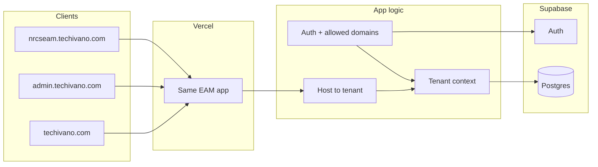

# Subdomain and tenant setup — Vercel, Supabase, and app implementation

**Overview:** Implement admin.techivano.com (mothership) and nrcseam.techivano.com (NRCS tenant) now using Vercel domains, Supabase auth, and app-side host-to-tenant resolution with per-tenant signup domain restrictions.

**Todos:**
- Create marketing/landing page for techivano.com (apex) with links to nrcseam.techivano.com and admin.techivano.com
- Admin login page for admin.techivano.com with same auth as NRCS EAM and Techivano/Ivano branding only

This plan ties the existing [SUBDOMAIN_AND_TENANT_PLAN.md](SUBDOMAIN_AND_TENANT_PLAN.md) to concrete steps using Vercel, Supabase, and codebase changes. It does **not** change techivano.com apex (stays marketing); it adds **admin.techivano.com** and **nrcseam.techivano.com** in the same phase (now).

---

## 1. Target behaviour (recap)

| Host                | Purpose                  | Allowed signup/login domains                               |
| ------------------- | ------------------------ | ---------------------------------------------------------- |
| techivano.com       | Marketing only           | —                                                          |
| admin.techivano.com | Mothership (Ivano staff) | **ivanotechnologies.com** only                             |
| nrcseam.techivano.com  | NRCS tenant              | Existing NRCS list (e.g. redcrossnigeria.org, ifrc.org, …) |

---

## 2. Vercel: domains and env

**2.1 Add subdomain domains to the same Vercel project**

- In **Vercel Dashboard**: Project → Settings → Domains → Add:
  - **admin.techivano.com**
  - **nrcseam.techivano.com**
- Both point to the **same** project that currently serves techivano.com (or staging), so one deployment serves all hosts.
- **Vercel CLI** (optional): `vercel domains add admin.techivano.com` and `vercel domains add nrcseam.techivano.com` if your CLI is linked to the project. DNS can be managed in your registrar (e.g. CNAME `admin` and `nrcs` → `cname.vercel-dns.com` or the value Vercel shows).

**2.2 DNS (registrar)**

- For **admin.techivano.com** and **nrcseam.techivano.com**: Create CNAME (or A/AAAA if Vercel instructs) for each, pointing to the same target as your current app (e.g. Vercel’s target). Vercel will show the exact record after you add each domain.

**2.3 Environment variables**

- No structural change: keep using one Vercel project and one set of env vars per environment (Production / Preview).
- For **production**, ensure:
  - `VITE_APP_URL` can stay `https://techivano.com` for emails/links; or you introduce a per-host app URL in app code (see below).
  - Supabase env vars (e.g. `SUPABASE_URL`, `SUPABASE_ANON_KEY`, etc.) stay as-is; one Supabase project can serve all subdomains.
- Optional: add **host–org mapping** via env for clarity, e.g.:
  - `HOST_ORG_ADMIN=uuid-for-ivano-org`
  - `HOST_ORG_NRCS=uuid-for-nrcs-org`
  (Used by the app to resolve tenant from `Host`.)

---

## 3. Supabase: auth and redirect URLs

**3.1 Redirect URLs**

- In **Supabase Dashboard**: Project → Authentication → URL Configuration:
  - Add **https://admin.techivano.com/** (and **https://admin.techivano.com/auth/callback** if you use a separate callback path).
  - Add **https://nrcseam.techivano.com/** (and **https://nrcseam.techivano.com/auth/callback**).
- Leave **https://techivano.com** in the list if the marketing site or any redirects use it; otherwise you can restrict to subdomains only.
- **Supabase CLI**: No change required for redirect URLs (they are project settings in the dashboard). Use CLI for migrations and config if you already do.

**3.2 No separate Supabase project per subdomain**

- One Supabase project continues to serve all subdomains. Tenant and allowed-domains logic live in the **app** (see below), not in Supabase Auth.

---

## 4. App: host-based tenant resolution and allowed domains

**4.1 Host → tenant (organization) mapping**

- **Where:** Extend `server/_core/context.ts` (and any shared helper used by tRPC and Express routes).
- **Current behaviour:** `resolveOrganizationContext` gets `organizationId` / `tenantId` from body, `x-organization-id`, `x-org-id`, query, session, user. It does **not** use `Host`.
- **Change:**
  - Add a small **host → organization** resolver: read `req.headers.host` (or `req.headers["x-forwarded-host"]` behind Vercel), normalize (e.g. lowercase, strip port).
  - If host is `admin.techivano.com` → set `organizationId` (and derived `tenantId` if you use a map) from config (env or DB) for the “Ivano” mothership org.
  - If host is `nrcseam.techivano.com` → set same for NRCS org.
  - If host is `techivano.com` (apex) → leave `organizationId` null (or redirect to marketing; no EAM context).
  - **Order:** Resolve from host **first**; if no host match, fall back to existing logic (header, query, session, user). That way existing clients that send `organizationId` still work.
- **Config:** Either env vars (e.g. `HOST_ORG_ADMIN`, `HOST_ORG_NRCS`) or a small table/config in DB (e.g. `organizations` + `host` or a `host_org_map` table). Env is enough for two hosts.

**4.2 Per-tenant allowed signup domains**

- **Current behaviour:** `server/_core/signupDomain.ts` uses global `ENV.allowedSignupDomains` (from `ALLOWED_SIGNUP_DOMAINS` or a default list). No host/tenant.
- **Change:**
  - When resolving context, once you have `organizationId` (including from host), determine “allowed domains” for that org:
    - **admin.techivano.com** (Ivano org): allow only **ivanotechnologies.com** (and optionally disable public signup; admin-created users only).
    - **nrcseam.techivano.com** (NRCS org): use current default list (redcrossnigeria.org, ifrc.org, gmail.com, etc.) or an NRCS-specific env list.
  - Expose a helper used by auth routes (e.g. `getAllowedSignupDomainsForOrganization(organizationId)` or `getAllowedSignupDomainsForRequest(req)`) and use it in signup and any “forgot password” or invite flows that validate email domain.
  - Implementation options: (a) env-based map (e.g. `ALLOWED_DOMAINS_ADMIN=ivanotechnologies.com`, `ALLOWED_DOMAINS_NRCS=redcrossnigeria.org,...`), or (b) DB table per org (e.g. `organization_settings.allowed_signup_domains`). Start with env for two tenants.

**4.3 Branding per host (optional but recommended)**

- Use the resolved tenant (from host) to choose branding: name, logo, theme. If you already have a “tenant config” or “organization” record, add branding fields or a small config; otherwise use a simple in-code or env map for “admin” vs “nrcs” (e.g. “Techivano” / “Ivano Technologies” vs “NRCS EAM”). The client can receive tenant slug or org id from an early API or from the same context so the UI can switch logo/title.

**4.4 Cookie scope**

- Ensure auth cookies (e.g. session) are set with **domain** that matches the current host (e.g. `admin.techivano.com`) or leave unset so they are host-scoped by default. That avoids sharing session across admin vs nrcs. Check `server/_core/cookies.ts` (or wherever the auth cookie is set): if you set `domain: .techivano.com`, all subdomains share the cookie; if you omit domain or set `domain: undefined`, the cookie is for the exact host. Prefer host-scoped for tenant isolation.

---

## 5. Order of implementation

1. **Vercel + DNS**
   - Add **admin.techivano.com** and **nrcseam.techivano.com** in Vercel (Dashboard or CLI).
   - Add CNAME (or record) for each at your registrar.
   - Verify SSL and that the same app answers on both subdomains.
2. **Supabase**
   - Add **https://admin.techivano.com** and **https://nrcseam.techivano.com** (and their auth/callback URLs) to Supabase Auth redirect URLs.
3. **App: host → org**
   - Implement host-based resolution in context (and where `getOrganizationIdFromRequest` is used so Express routes see it): admin.techivano.com → Ivano org, nrcseam.techivano.com → NRCS org; apex → no org.
   - Ensure “Ivano” and “NRCS” organizations exist in DB and that their UUIDs are in env (e.g. `HOST_ORG_ADMIN`, `HOST_ORG_NRCS`).
4. **App: allowed domains**
   - Switch signup (and any relevant auth) to use per-tenant allowed domains: Ivano org → ivanotechnologies.com only; NRCS org → existing list.
5. **App: branding**
   - Use resolved tenant to serve Techivano/Ivano branding on admin.techivano.com and NRCS branding on nrcseam.techivano.com.
6. **Marketing page for techivano.com**
   - Create a dedicated marketing/landing page served when Host is **techivano.com** (apex). Content: product overview, value proposition, and links to **NRCS EAM** (nrcseam.techivano.com) and **Ivano Staff** (admin.techivano.com). No EAM app or login on the apex; optionally use a simple static page or a minimal React route that renders only this content when on the apex domain. Ensure routing or Vercel rewrites so techivano.com (and www if used) serves this page instead of the EAM SPA.
7. **Admin login page for admin.techivano.com**
   - Create (or reuse) a login page for **admin.techivano.com** that uses the **same auth settings and flow** as the current NRCS EAM (Supabase, email/password, OAuth if configured, same callback and session handling), but with **Techivano / Ivano Technologies branding only** (no NRCS logo, no “NRCS EAM” copy). Reuse existing `client/src/pages/Login.tsx` and `client/src/components/AuthPageLayout.tsx` with an “admin”/“ivano” variant: Techivano or Ivano logo, “Sign in to Techivano EAM” (or similar), same form and auth logic. Signup can be disabled or restricted to ivanotechnologies.com as per host-based allowed domains.
8. **NRCS migration (later)**
   - When moving to eam.redcrossnigeria.org or redcrossnigeria.org/eam: add that origin in Supabase, point DNS to your app (or proxy), and add the new host to the app’s host → NRCS org mapping so the same tenant is used.

---

## 6. CLI and MCP usage (how to carry this out)

**6.1 Vercel**

- **Dashboard:** Add domains (admin.techivano.com and nrcseam.techivano.com), confirm SSL, and manage env vars.
- **CLI:** `vercel link` (if not already), `vercel env ls` / `vercel env add` for env; `vercel domains add admin.techivano.com` and `vercel domains add nrcseam.techivano.com`. Deployments remain via `git push` (or `vercel --prod`) once the project is connected.
- **MCP:** If the workspace has a Vercel MCP (e.g. user-vercel), use it to add domains or inspect project/config; otherwise Dashboard + CLI is enough.

**6.2 Supabase**

- **Dashboard:** Authentication → URL Configuration → add redirect URLs for admin.techivano.com and nrcseam.techivano.com.
- **CLI:** `supabase link` (if not already), `supabase db push` / `supabase migration up` for any schema changes (e.g. org settings table if you add one). No migration required for “host in app config” or env-only host → org.
- **MCP:** If a Supabase MCP is available, use it to read project settings or run migrations; otherwise CLI + Dashboard suffice.

**6.3 Other**

- **Registrar (e.g. Cloudflare, Namecheap):** Add CNAME (or A) for admin.techivano.com and nrcseam.techivano.com as shown by Vercel.
- No separate “subdomain” MCP is required; the app derives tenant from the `Host` header.

---

## 7. Diagram (high level)

---

## 8. Files to touch (summary)

| Area            | Files / location                                                                                                                                 |
| --------------- | ------------------------------------------------------------------------------------------------------------------------------------------------ |
| Host → org      | `server/_core/context.ts` (and possibly `server/_core/index.ts` if `getOrganizationIdFromRequest` is used without going through createContext)   |
| Allowed domains | `server/_core/signupDomain.ts`; auth routers that call it (e.g. signup, signupWithPassword)                                                    |
| Config          | New small module or env: host → org id; org id → allowed domains (or reuse ENV with per-tenant keys)                                             |
| Cookies         | `server/_core/cookies.ts` (ensure domain not set to .techivano.com if you want host-scoped cookies)                                              |
| Branding        | Client: read tenant/org from API or env; `client/src` layout/components that show logo/title                                                    |
| Marketing page  | New route or entry for apex (techivano.com): e.g. `client/src` marketing/landing route or static export; routing so apex host serves this page   |
| Admin login     | Reuse `client/src/pages/Login.tsx` and `client/src/components/AuthPageLayout.tsx` with Techivano/Ivano-only branding variant; same auth (Supabase) as NRCS EAM |

No change to `vercel.json` for subdomains; Vercel serves the same app for every domain you add. No Supabase schema change required unless you add an org-level “allowed domains” or “branding” table.
